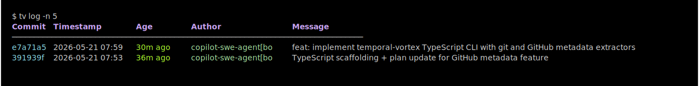
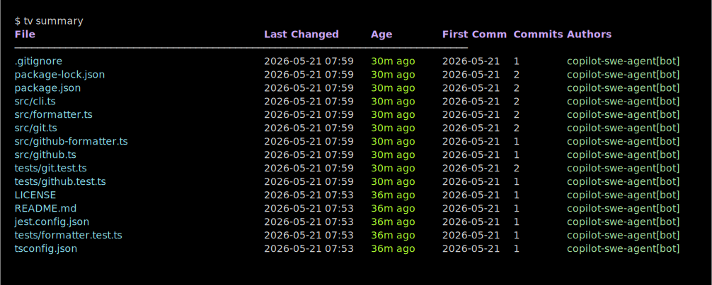
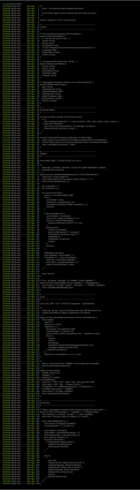
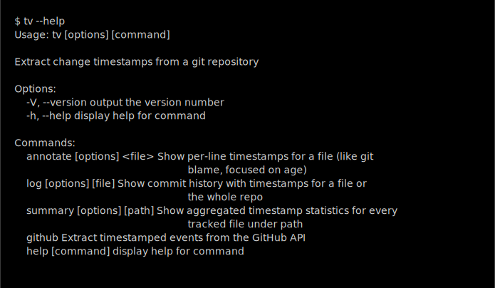

# temporal-vortex

> A GitLens-inspired CLI for surfacing timestamped change events from a git repository and the GitHub API.

## Developer Setup

### Git Hooks

This repository uses git hooks to enforce commit message standards. When you run `npm install`, the `prepare` script automatically configures your git repository to use the `.githooks/` directory for commit hooks.

**Note:** This modifies your local git configuration (`core.hooksPath`) only for this repository and does not affect other repositories. You can manually undo this with `git config --unset core.hooksPath`.

**Commit Message Hook:** The `commit-msg` hook rejects commits with the placeholder message "Initial Plan" to ensure meaningful commits are made to PRs. If you encounter this error, amend your commit with a real message:

```sh
git commit --amend -m "Your meaningful commit message"
```

### Checking Out PRs

You can check out any pull request using one of these methods:

**Method 1: Clone/fetch a snapshot branch (easiest)**

Once a PR has a real commit (after the "Initial Plan" placeholder), a snapshot branch is automatically created at `snapshots/pr-<PR-NUMBER>`:

```sh
git fetch origin snapshots/pr-<PR-NUMBER>
git checkout snapshots/pr-<PR-NUMBER>
```

Or clone directly:

```sh
git clone --branch snapshots/pr-<PR-NUMBER> <your-repo-url>
```

**Method 2: Fetch PR directly using git refs (always works)**

```sh
git fetch origin refs/pull/<PR-NUMBER>/head:pr-<PR-NUMBER>
git checkout pr-<PR-NUMBER>
```

## Commands

### `tv log [file]`

Show commit history with color-coded age timestamps.



### `tv summary [path]`

Show per-file timestamp statistics (newest change, first commit, commit count, authors).



### `tv annotate <file>`

Per-line blame with age-colored timestamps, similar to `git blame`.



### `tv --help`



## GitHub commands

```sh
# All timestamped events (comments, reviews, workflow runs)
tv github events <owner/repo>

# GitHub Actions workflow runs (agent start/end timestamps)
tv github workflows <owner/repo>
```

Requires a `GITHUB_TOKEN` env var or the `--token` flag.

## Install

```sh
npm install -g temporal-vortex
```

## Regenerate screenshots

```sh
npm run screenshot
```
